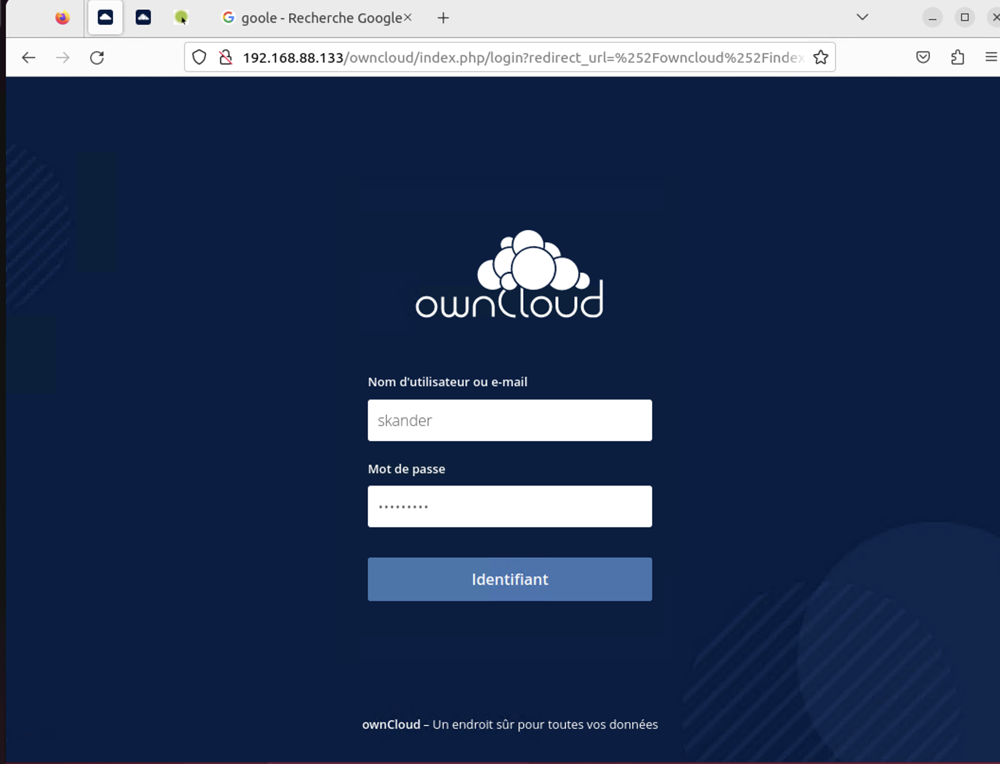
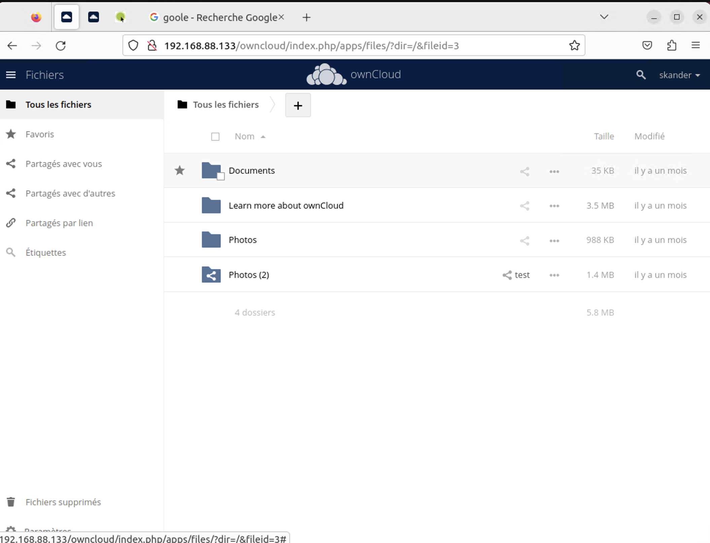
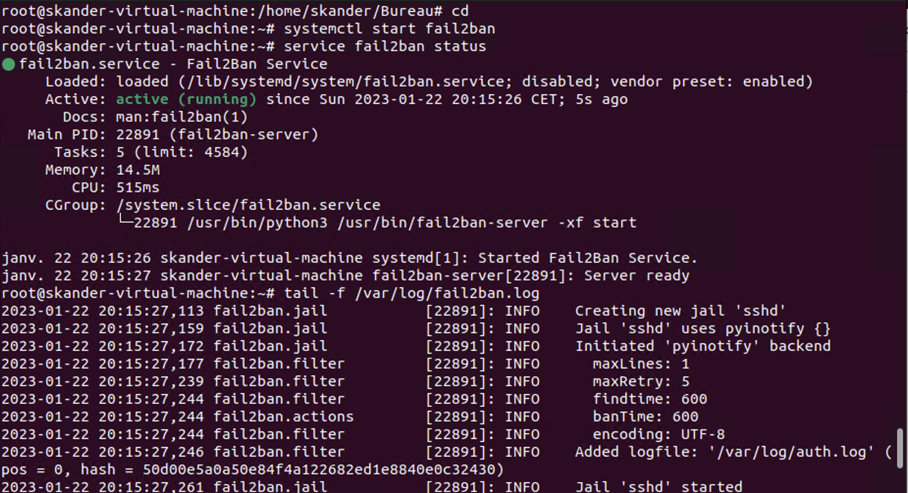
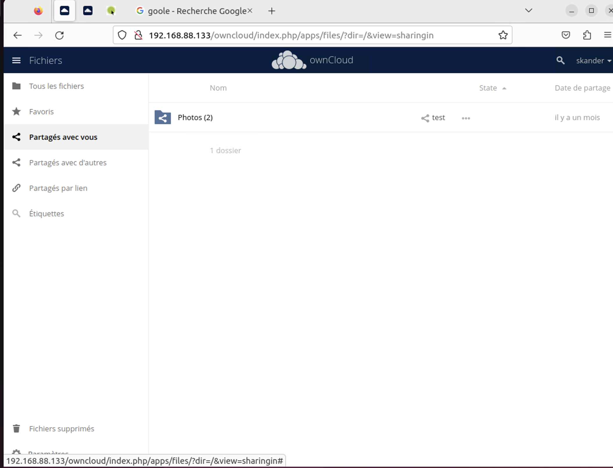
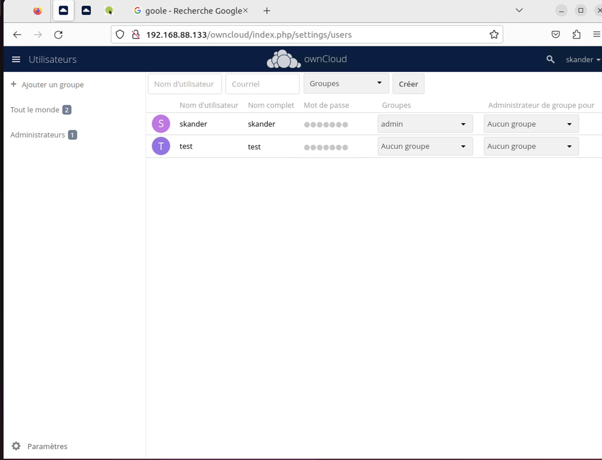

##### 02/2023                               | "Credit by Floriant and Skander" |  


## Install Apache2 HTTP Server

##### Install Apache2 on Ubuntu by running the following commands:

```bash
sudo apt install apache2
```

##### After installing Apache2, run the commands below to disable directory listing:

```bash
sudo sed -i "s/Options Indexes FollowSymLinks/Options FollowSymLinks/" /etc/apache2/apache2.conf
```

##### After install Apache2, the commands below can be used to stop, start and enable Apache2 service to always start up with the server boots.

```bash
sudo systemctl stop apache2.service

sudo systemctl start apache2.service

sudo systemctl enable apache2.service
```

## Install Mariadb Server

##### To install MariaDB run the commands below:

```bash
sudo apt-get install mariadb-server mariadb-client
```

##### The commands below is use to stop, start and enable MariaDB servuce to always start up when the server boots

```bash
sudo systemctl stop mariadb.service
sudo systemctl start mariadb.service
sudo systemctl enable mariadb.service
```

##### After that, run the commands below to secure MariaDB server:

```bash
sudo mysql_secure_installation
```

* Enter current password for root(enter for none): Just press Enter
* Set root password: Yes
* New password: Enter password
* Re-enter new paswword: Repeat password
* remove anonymous user: Yes
* Disallow root login remotely: Yes
* Remove test database and access to it?: Yes
* Reload privilege tables now: Yes

##### Restart MariaDb Service:

```bash 
sudo systemctl restart mariadb.service
```

## Installation de PHP7.4 and Related Modules (Version 7.4 it's important)

##### Run the commands below to add a third party repository and upgrade to PHP 7.4:

```bash
sudo apt-get install software-properties-common -y
sudo add-apt-repository ppa:ondrej/php
```
##### Then update and upgrade to PHP 7.4:

```bash
sudo apt update
```
##### Run the commands below to install PHP 7.4 and related modules:

```bash
sudo apt install php7.4 libapache2-mod-php7.4 php7.4-common php7.4-mbstring php7.4-xmlrpc php7.4-soap php7.4-apcu php7.4-smbclient php7.4-ldap php7.4-redis php7.4-gd php7.4-xml php7.4-intl php7.4-json php7.4-imagick php7.4-mysql php7.4-cli php7.4-mcrypt php7.4-ldap php7.4-zip php7.4-curl -y
```
##### After install PHP 7.4, run the commands below to open FPM PHP default file:

```bash
sudo nano /etc/php/7.4/apache2/php.ini
```
changes the values :

```bash
file_uploads = On
allow_url_fopen = On
memory_limit = 256M
upload_max_filesize = 100M
display_errors = Off
date.timezone = America/Florida
```

## Create OwnCloud Database

Now that you’ve install all the required packages, continue to start configuring the server.

##### To connect to MariaDB server, run the commands below:

```bash
sudo mysql -u root -p
```
##### Then create a database called owncloud:

```bash
CREATE DATABASE owncloud;
```
##### Create a database user called ownclouduser with new password:

```bash
CREATE USER 'ownclouduser'@'localhost' IDENTIFIED BY 'password_here';
```
##### Then grant the user full access to the database:

```bash
GRANT ALL ON owncloud.* TO 'ownclouduser'@'localhost' IDENTIFIED BY 'password_here' WITH GRANT OPTION;
```
#### Now, save your changes and exit:

```bash
FLUSH PRIVILEGES;
EXIT;
```

## Download Latest OwnCloud Release

##### Download Owncloud FOR UBUNTU 21.04:
check your version here: https://software.opensuse.org//download.html?project=isv:ownCloud:server:10&package=owncloud-complete-files

```bash
echo 'deb http://download.opensuse.org/repositories/isv:/ownCloud:/server:/10/Ubuntu_21.04/ /' | sudo tee /etc/apt/sources.list.d/isv:ownCloud:server:10.list
curl -fsSL https://download.opensuse.org/repositories/isv:ownCloud:server:10/Ubuntu_21.04/Release.key | gpg --dearmor | sudo tee /etc/apt/trusted.gpg.d/isv_ownCloud_server_10.gpg > /dev/null
sudo apt update
sudo apt install owncloud-complete-files
cd /var/www/
```
##### move the folder to the correct place 

```bash
sudo mv owncloud /var/www/html/owncloud/
```

##### Then run the commands below to set the correct permissions for OwnCloud to function

```bash
sudo chown -R www-data:www-data /var/www/html/owncloud/
sudo chmod -R 755 /var/www/html/owncloud/
```
## Configure Apache2

##### Go back to home with this command:

```bash
cd
```

##### Configure Apache2 site configuration file for OwnCloud. This file will control how users access OwnCloud content. Run the commands below to create a new configuration file called owncloud.conf

```bash
sudo nano /etc/apache2/sites-available/owncloud.conf
```

##### Then copy and paste the content below into the file and save it. Replace the highlighted in red lines with your own domain name and directory root location.  NB: you have to change the SERVERNAME AND SERVERALIAS L4,L5:

```bash
<VirtualHost \*:80>
ServerAdmin admin@example.com
DocumentRoot /var/www/html/owncloud/
ServerName avoiderrors.com
ServerAlias www.avoiderrors.com

     Alias /owncloud "/var/www/html/owncloud/"

     <Directory /var/www/html/owncloud/>
        Options +FollowSymlinks
        AllowOverride All
        Require all granted
          <IfModule mod_dav.c>
            Dav off
          </IfModule>
        SetEnv HOME /var/www/html/owncloud
        SetEnv HTTP_HOME /var/www/html/owncloud
     </Directory>

     ErrorLog ${APACHE_LOG_DIR}/error.log
     CustomLog ${APACHE_LOG_DIR}/access.log combined

</VirtualHost>
```

## Enable the OwnCloud and Rewrite Module:

##### After configuring the VirtualHost above, enable it by running the commands below:

```bash
sudo a2ensite owncloud.conf
sudo a2enmod rewrite
sudo a2enmod headers
sudo a2enmod env
sudo a2enmod dir
sudo a2enmod mime
```
## Restart Apache2

##### To load all the settings above, restart Apache2 by running the commands below.

```bash
sudo systemctl restart apache2.service
```

## Access Owncloud from the LAN
1- Open the terminal and enter the following command:

```bash
sudo apt install net-tools
ifconfig
```
2- Search for your local IP  

3- place your Local IP in the adress bar like this:

http://192.XXX.XX.XX/owncloud

## Installation de Fail2ban 

##### Update

```bash
sudo apt-get update
```
##### To install Fail2ban run the commands below:

```bash
sudo apt-get install fail2ban
```
##### Go to file owncloud.conf

```bash
sudo nano /etc/fail2ban/filter.d/owncloud.conf
```

##### copy and paste the following text in owncloud.conf:
```bash
[Definition]
failregex={"reqId":".","remoteAddr":"<HOST>","app":"core"."Invalid ._ credentials._"}
ignoreregex =
```

##### Go to file owncloud.conf

```bash
sudo nano /etc/fail2ban/jail.d/owncloud.local
```

##### copy and paste the following text in owncloud.local:

```bash
[owncloud]
enabled = true
port = http,https
filter = owncloud
logpath = /var/log/owncloud.log
maxretry = 3
bantime = 3600
findtime = 600
```

##### Restart Fail2ban 

```bash
sudo service fail2ban restart
```

## Images

















### | "Credit by Floriant and Skander" |  


